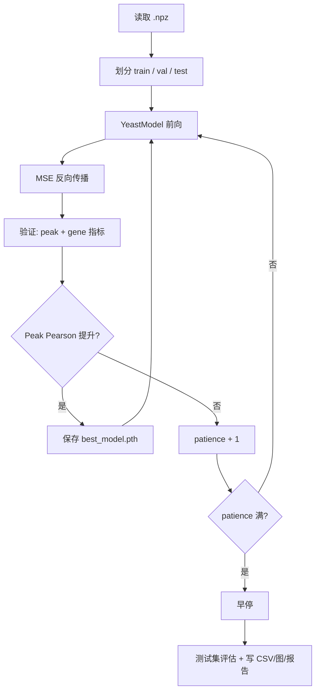

# SC 单 Peak 训练脚本说明

本文档总结 `scripts/train_yeast_single_peak_sc.py` 的用途、调用方式、监控指标和输出内容，方便快速查阅「一次训练到底在干什么」。

---

## 1. 一句话概括

用 **SC 酵母 ATAC 数据**，以 **每个 peak × 每个条件样本** 为一条训练记录，训练一个 **Transformer 模型**，预测该 peak 在 **正链 / 负链** 上的 log2 表达量。

**双轨监控策略**（有意为之，见第 5 节）：

- **Peak 级 Pearson r** → 早停、保存 `best_model.pth`（训练过程「方向盘」）
- **Gene 级指标** → 最终关心的生物学效果（测试报告、散点图、详细 CSV）

---

## 2. 如何启动一次训练

### 2.1 入口

```bash
cd GetForYeast
python scripts/train_yeast_single_peak_sc.py
```

脚本通过 **Hydra** 加载配置：

| 项 | 值 |
|---|---|
| 配置文件 | `get_model/config/yeast_training_sc.yaml` |
| 覆盖方式 | 命令行传参，例如 `data.input_files.atac1=...` |

### 2.2 调用链（从 main 到训练结束）

```
main()
  └─ train_experiment()
       ├─ YeastPeakSingleDataset / MultiSinglePeakDataset   # 读 .npz
       ├─ create_data_loaders()                             # 划分 train/val/test
       ├─ YeastModel(config.model.model)                    # 建模型
       ├─ AdamW + LR Scheduler + TensorBoard
       └─ for epoch in range(max_epochs):
            ├─ 训练循环（MSE 反向传播）
            ├─ evaluate_model_gene_level()  # 验证
            ├─ 保存 best_model.pth（按 val Pearson）
            ├─ 早停判断
            └─ 定期画验证散点图
       └─ 测试集评估 + save_final_results()
```

### 2.3 输出目录命名

```
{output_base_dir}/{output_dir}_{时间戳}/
```

例如：`output/shuffle_label_negative_control_20260605_092316/`

---

## 3. 数据：一条样本是什么？

### 3.1 输入文件

- 默认：`data/SC_ATAC1.npz`（可在 yaml 或命令行覆盖）
- 格式：`(num_samples, num_peaks, 547)`

### 3.2 547 列的含义

| 列范围 | 内容 | 维度 |
|--------|------|------|
| 0–469 | Motif 强度（已区分 strand） | 470 |
| 470 | Accessibility（染色质可及性） | 1 |
| 471–544 | Condition 条件特征 | 74 |
| 545 | 标签：正链表达 log2 | 1 |
| 546 | 标签：负链表达 log2 | 1 |

**有效样本**：正链、负链标签均非 NaN / Inf 的 `(sample_idx, peak_idx)` 对。

### 3.3 「单 Peak」的含义

- 每个 batch 元素 = **一个 peak 在一个条件下的特征 + 两条链表达**
- **不同 peak 之间不互相 attend**，也不共享上下文
- 模型输入 shape：`[batch, 1, 545]`，序列长度始终为 1（再加 1 个 CLS token，见第 5 节）

### 3.4 数据划分策略（`data.split_strategy`）

| 策略 | 划分单位 | 比例 | 适用场景 |
|------|----------|------|----------|
| `sample`（当前默认） | 按 **条件/样本** 划分 | 70% / 15% / 15% | gene 级评估更稳定（同一样本内 peak 不跨集合） |
| `peak` | 按 **基因组位点** 划分 | 70% / 15% / 15% | 测试对「未见过位点」的泛化；gene 评估可能有缺失 peak |

划分种子：`experiment.seed`（默认 42）。  
若设置了 `data.split_cache_path`，会额外写出 split 的 JSON 供其他脚本复用。

### 3.5 Gene→Peak 映射（用于 gene 级评估）

`.npz` 内可含 `g2p_pos` / `g2p_neg`（或旧名 `p2g_*`）稀疏矩阵：

- 行 = 基因，列 = peak，值为聚合权重（行和归一化为 1）
- 用于把 peak 预测加权汇总成 gene 表达，**不参与训练反向传播**

---

## 4. 模型结构（有没有注意力？）

**有**，底层是 `YeastModel`（`get_model/model/yeast_model.py`），结构类似 BERT-base：

```
输入 [B, 1, 545]
  → RegionEmbed（线性 545→768）
  → 拼接 CLS token → [B, 2, 768]
  → GETTransformer × 12 层（每层：Multi-Head Self-Attention + MLP）
  → 去掉 CLS → [B, 1, 768]
  → ExpressionHead（768→2，正/负链）
  → Softplus（保证输出 > 0）
```

### 4.1 注意力在这里实际做了什么？

| 配置项 | 默认值 |
|--------|--------|
| embed_dim | 768 |
| num_heads | 12 |
| num_layers | 12 |
| dropout | 0.1 |

在 **单 Peak 模式** 下，序列只有 **2 个 token**（CLS + 该 peak），因此：

- Self-Attention 只在 CLS 与这 1 个 peak token 之间交互
- **没有跨 peak、跨基因的注意力**
- Transformer 更像「带 CLS 全局汇总的 MLP 编码器」，而非序列建模

> 若需要 peak 间关系，应使用 windowed 版本脚本（`window_size` 等参数在 yaml 里为另一脚本预留）。

### 4.2 训练损失

- **MSE**（`model.compute_loss`），同时对正链、负链两个输出求平均
- 优化器：**AdamW**（lr、weight_decay 见 yaml）
- 可选：梯度裁剪 `clip_grad`、warmup + cosine 学习率调度

---

## 5. 监控指标：Peak 还是 Gene？（重点）

### 5.0 为什么用 Peak 做早停，却更关心 Gene？

这是本项目的**设计选择**，不是随手写的实现细节。

**Gene 级指标在训练初期不可靠，不适合做早停：**

1. Gene 表达由多个 peak **加权聚合**（g2p 反向分配）得到，本身会**平滑 peak 级噪声**
2. 因此 gene 级 Pearson 往往在**一开始就显得偏高**，且在前若干 epoch **增长很慢甚至停滞**
3. 若用 gene Pearson 做早停，容易误判「已经够好」或「长期无改善」，**过早停训**或**选错 checkpoint**

**Peak 级指标更适合驱动训练：**

- 直接反映模型对单 peak 表达的拟合是否在进步
- 对 loss 下降更敏感，能更可靠地指示「模型还在学」

**但生物学上我们更关心 Gene：**

- 最终评判、论文图、与实验对照，仍以 **gene 级测试指标** 为准
- 验证散点图优先画 gene 级；`test_gene_predictions.csv`、`test_gene_evaluation.png` 是主要交付物之一
- `validation_history_detailed.csv` 里同时保留两套指标，便于事后对比

> 简记：**Peak 管训练节奏，Gene 管最终效果。**

---

建议记住下面这张表：

| 阶段 | 用什么算 | 粒度 | 说明 |
|------|----------|------|------|
| **训练 loss** | MSE | peak × strand | 每个 batch 直接算预测 vs 标签 |
| **训练 MAE** | \|pred − true\| 均值 | peak × strand | 仅日志展示，不参与早停 |
| **验证 / 测试主流程** | `evaluate_model_gene_level` | 同时算 peak + gene | 见下 |
| **早停 & 保存 best_model** | **Peak 级 Pearson r** | peak（pos/neg 展平拼接） | `val_pearson > best + min_delta` |
| **验证散点图** | 优先 **gene 级** | gene（若有 g2p） | 否则退回 peak 级 |
| **TensorBoard** | 两套都记 | Peak/* 与 Gene/* | `Pearson/Validation` 来自 peak（早停用） |
| **最终报告 / 测试** | 两套都出 | 优先看 **gene** | `test_gene_*` 是生物学主结论 |

### 5.1 Peak 级指标怎么算？

1. 对验证/测试集每个 `(sample, peak)` 预测 `[pos, neg]`
2. 把所有 pos、neg **展平拼成一条长向量**
3. 在这条向量上算 Pearson r、Spearman ρ、R²、MAE、MSE

→ 一个 peak 贡献 2 个点（正链 + 负链）。

### 5.2 Gene 级指标怎么算？

1. 先把预测填回 `(sample, peak)` 矩阵
2. 用 `g2p_pos`、`g2p_neg` 稀疏矩阵做加权求和：`gene_expr = G @ peak_expr`
3. 对所有 sample 的 gene 预测/真值拼接，再算 Pearson、MAE 等

→ 需要 `.npz` 里带 g2p 映射；没有映射则 gene 级为空。

### 5.3 读日志时：标题容易误导

早停用 peak、最终关心 gene——这个逻辑是对的；但 **日志排版有一处容易看错**：

| 日志位置 | 实际内容 | 用途 |
|----------|----------|------|
| `🧬 Gene 级验证 ⭐` 标题下的 Pearson / MAE | 实际是 **peak 级**（脚本约 1468–1471 行） | 与早停同一套数，但标题写错了 |
| `validation - gene级 Pearson=...` | 真正的 **gene 级** | 看 gene 是否在后期追上来 |
| `📊 Peak 级验证 (参考)` | peak 级（与上行重复） | 对照参考 |
| `validation_history_detailed.csv` | `peak_*` 与 `gene_*` 分列 | **事后分析首选** |

**早停 / `best_model.pth` / `training_history.csv` 的 `val_pearson`** → 全部是 **peak 级**，符合第 5.0 节的设计。

看 gene 效果请直接查：`gene_pearson` 列、TensorBoard `Gene/Pearson`、验证散点图（gene-level 标题）、测试集 `test_gene_*` 文件。

### 5.4 早停规则

| 参数 | 默认值 | 含义 |
|------|--------|------|
| `early_stopping_patience` | 15 | 连续多少 epoch 无改善则停止 |
| `early_stopping_min_delta` | 0.01 | Pearson r 至少提升多少才算「改善」 |
| 监控指标 | Peak Pearson r | 越大越好 |

---

## 6. 主要参数一览（`yeast_training_sc.yaml`）

### 6.1 训练

| 参数 | 默认 | 说明 |
|------|------|------|
| `training.batch_size` | 4096 | 每步样本数（peak×条件条数） |
| `training.num_workers` | 16 | DataLoader 进程数 |
| `training.learning_rate` | 0.004 | AdamW 初始学习率 |
| `training.weight_decay` | 0.01 | L2 正则 |
| `training.max_epochs` | 100 | 上限 epoch |
| `training.warmup_epochs` | 3 | 前 3 epoch 线性 warmup |
| `training.clip_grad` | 1.0 | 梯度范数裁剪 |
| `training.use_fp16` | true | yaml 中有，**当前训练脚本未实际启用混合精度** |

### 6.2 数据

| 参数 | 默认 | 说明 |
|------|------|------|
| `data.input_files.atac1` | `data/SC_ATAC1.npz` | 训练数据 |
| `data.output_base_dir` | `output` | 输出根目录 |
| `data.split_strategy` | `sample` | `sample` 或 `peak` |
| `data.split_cache_path` | `data/SC_ATAC1_split_meta.json` | split 缓存 |
| `data.tpm_aggregation` | `tpm_then_log` | gene 聚合策略（评估用） |

### 6.3 实验元信息

| 参数 | 说明 |
|------|------|
| `training_name` | 实验名（写入日志） |
| `training_description` | 实验描述 |
| `output_dir` | 输出子目录前缀 |
| `experiment.seed` | 随机种子 |

### 6.4 学习率调度

| 参数 | 默认 |
|------|------|
| `scheduler.type` | `cosine` |
| `scheduler.cosine.eta_min` | 1e-5 |

流程：warmup（3 epoch，0.1×lr → lr）→ CosineAnnealing 至 `eta_min`。

### 6.5 命令行覆盖示例

```bash
python scripts/train_yeast_single_peak_sc.py \
  data.input_files.atac1=input/shuffle/ATAC1_train_label_shuffled.npz \
  output_dir=shuffle_label_negative_control \
  training_name=NEG_SHUFFLE_LABEL_ATAC1 \
  data.split_strategy=sample
```

---

## 7. 一次训练会输出什么？

以 `output/shuffle_label_negative_control_20260605_092316/` 为例：

### 7.1 核心产物

| 文件 | 内容 |
|------|------|
| `best_model.pth` | 验证 peak Pearson 最高时的 checkpoint |
| `experiment_config.yaml` | 本次完整 Hydra 配置快照 |
| `train_single_peak.log` | 文本训练日志 |

### 7.2 指标与历史

| 文件 | 内容 |
|------|------|
| `training_history.csv` | 每 epoch：train/val loss、MAE、val_pearson、lr |
| `validation_history_detailed.csv` | 每 epoch：peak + gene 分项指标 |
| `test_metrics_summary.csv` | 测试集 peak（及 gene）指标汇总 |
| `test_predictions.csv` | 测试集逐条 peak 预测（含 peak_id、strand） |
| `test_gene_predictions.csv` | 测试集 gene 级预测（若有 g2p） |

### 7.3 图表

| 文件 | 内容 |
|------|------|
| `validation_plots/val_scatter_epoch_XXXX.png` | 验证散点（前 10 epoch 每 2 轮，之后每 10 轮） |
| `test_evaluation.png` | 测试集 peak 级散点（pos+neg 拼接） |
| `test_gene_evaluation.png` | 测试集 gene 级散点（若有） |
| `training_analysis.png` | 损失/MAE/相关性/LR/误差分布等多子图 |
| `learning_rate.png` | 学习率曲线 |
| `training_report.md` | 自动生成的文字报告 |

### 7.4 TensorBoard

```bash
tensorboard --logdir output/<实验目录>/tensorboard_logs
```

记录：Loss、MAE、Pearson、Spearman、R²、Peak/*、Gene/*、验证散点图、超参数等。

### 7.5 中断（Ctrl+C）时额外输出

若训练被中断且未完成：

- `interrupted_test_predictions.csv`
- `interrupted_test_evaluation.png`
- `interrupted_test_report.md`

---

## 8. 流程图（整体）



---

## 9. 与其他脚本的关系

| 脚本 | 关系 |
|------|------|
| `get_model/config/yeast_training_sc.yaml` | 默认配置 |
| `get_model/model/yeast_model.py` | 模型定义 |
| `scripts/infer_yeast_single_peak.py` | 用 `best_model.pth` 做推理 |
| `scripts/train_yeast_single_peak_km.py` | KM 数据版本（特征 242 维） |

---

## 10. 阅读日志时的快速检查清单

1. **数据**：`547列 = 545特征 + 2标签` 是否打印 ✅
2. **划分**：`Sample级` 还是 `Peak级`？
3. **g2p**：是否 `已加载 gene→peak 映射`？没有则只有 peak 级评估
4. **训练**：`损失` / `MAE` 是否为 nan（标签 shuffle 负对照实验可能出现）
5. **训练过程**：看 `validation - peak级 Pearson` 与 `早停计数`（peak 驱动训练）
6. **Gene 是否在变好**：看 `validation - gene级 Pearson` 或 `validation_history_detailed.csv`
7. **最终结果（生物学）**：`test_gene_evaluation.png` + `test_gene_predictions.csv`；peak 级作辅助

---

## 11. 常见问题简答

**Q：训练时模型有没有用到 peak 之间的信息？**  
A：没有。单 peak 模式下每条样本独立，注意力只在 CLS 与单个 peak token 之间。

**Q：损失函数优化的是 peak 还是 gene？**  
A：Peak。直接对每条 peak 的正/负链表达做 MSE。

**Q：为什么早停用 Peak，却不直接用 Gene？**  
A：g2p 聚合会平滑噪声，gene Pearson 初期偏高、增长慢，不适合做早停；peak 更能反映模型是否在学。最终效果仍以 gene 测试指标为准。见第 5.0 节。

**Q：日志「Gene 级验证」和早停指标对不上？**  
A：标题是历史遗留，底下数字实际是 peak 级（与早停一致）。真 gene 数看 `validation - gene级 Pearson` 或 `validation_history_detailed.csv`。

**Q：`use_fp16: true` 会加速吗？**  
A：yaml 里有该字段，但 `train_yeast_single_peak_sc.py` 训练循环 **未调用 autocast**，目前实际是全精度 FP32 训练。

**Q：负对照（shuffle label）实验预期什么？**  
A：Peak / Gene 的 Pearson 应接近 0 或无效（nan），说明模型无法从特征学到被洗乱的标签——用于检查数据泄露。

---

*文档对应脚本：`GetForYeast/scripts/train_yeast_single_peak_sc.py`*  
*默认配置：`GetForYeast/get_model/config/yeast_training_sc.yaml`*
